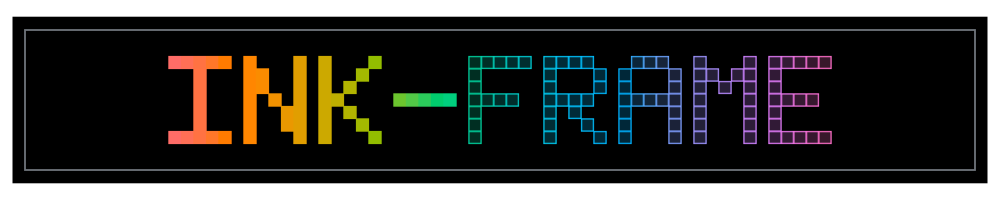
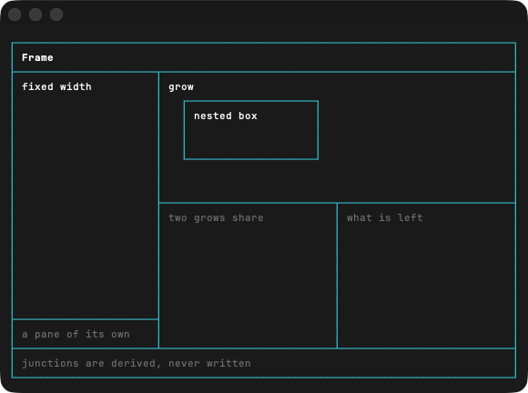

# ink-frame

[](https://www.npmjs.com/package/@oliveryasuna/ink-frame)

Grids of bordered boxes for [Ink](https://github.com/vadimdemedes/ink), where the borders actually join where they meet.

Ink's own box borders are fine for a single box. Put two of them next to each other and the seam between them comes out as `││`, two parallel lines instead of one shared edge. That's because a box border is one unbroken line and there's nowhere to hang a `┬` or a `┼` part-way along it. `ink-frame` sidesteps that by painting every border into a single character grid and resolving each cell once, so a spot where four boxes meet becomes a `┼` and a T-junction becomes a `┬`, `┤`, and so on, without you ever writing those characters yourself.



## Install

```sh
bun add @oliveryasuna/ink-frame

# or pnpm
pnpm add @oliveryasuna/ink-frame

# or npm
npm install @oliveryasuna/ink-frame

# or yarn
yarn add @oliveryasuna/ink-frame
```

It expects `ink` (>=5) and `react` (>=18) alongside it, which you'll already have if you're building an Ink app.

## The idea

You describe your layout as rectangles, hand those rectangles to `Frame`, and it works out the borders. A rectangle is just outer bounds in terminal cells:

```ts
interface Rect {
  left: number;
  top: number;
  width: number;
  height: number;
}
```

You rarely build those by hand. `splitColumns` and `splitRows` carve one rect into several, and they overlap adjacent rects by a single cell on purpose. That shared cell is the whole trick: both boxes paint an edge into it, so it resolves to a junction rather than to two lines sitting side by side.

```tsx
import {render, Text, useStdout} from 'ink';
import {Frame, Pane, splitColumns, splitRows} from '@oliveryasuna/ink-frame';

const App = () => {
  const {stdout} = useStdout();
  const width = stdout.columns || 80;
  const height = stdout.rows || 24;

  const root = {left: 0, top: 0, width, height};

  // '3' is three cells tall (two borders plus a line of content);
  // 'grow' takes whatever the fixed bands leave behind.
  const [header, body, footer] = splitRows(root, [3, 'grow', 3]);
  const [side, main] = splitColumns(body, [24, 'grow']);

  return (
    <Frame width={width} height={height} borderColor="cyan">
      <Pane rect={header} paddingX={1}><Text bold>My App</Text></Pane>
      <Pane rect={side} paddingX={1}><Text>sidebar</Text></Pane>
      <Pane rect={main} paddingX={1}><Text>main</Text></Pane>
      <Pane rect={footer} paddingX={1}><Text dimColor>status line</Text></Pane>
    </Frame>
  );
};

render(<App />);
```

Splits nest as deep as you want. Split the `body` into columns, split one of those columns into rows, keep going. And a rect doesn't have to come from a split at all. Build one by hand inside another pane and its border stays separate rather than merging with the pane around it, which is how you get a framed box floating inside a larger region.

## Panes

`Pane` doesn't render anything on its own. `Frame` reads the `rect` off each `Pane` during its own layout, draws the border, and then lays your content inside that border with absolute positioning. So your pane's children are ordinary Ink elements that know nothing about borders or where they sit on screen.

Every [`Box`](https://github.com/vadimdemedes/ink#box) prop passes straight through to the content area, so `paddingX`, `flexDirection`, `justifyContent`, and the rest work as you'd expect:

```tsx
<Pane rect={header} paddingX={1} justifyContent="space-between">
  <Text bold>Title</Text>
  <Text dimColor>right side</Text>
</Pane>
```

Position and size come from the `rect` and can't be overridden. That's deliberate. The rect is the single source of truth for where a pane lives, both for the border and for the content.

`Pane` has to be a direct child of `Frame` (fragments are fine, they get flattened). Anything that isn't a `Pane` is ignored.

## Reading a pane's usable space

`interiorOf` gives you the area inside a border, which is the rect minus its two edges. Handy when a child needs to know how much room it really has:

```tsx
import {interiorOf} from '@oliveryasuna/ink-frame';

const inner = interiorOf(main); // {left, top, width, height} of the content area
```

When a box is too small to have an interior, the width or height comes back as `0`, and `Frame` skips drawing content into it.

## Sizing

Sizes passed to `splitColumns` / `splitRows` are either a fixed number of cells or `'grow'`. The fixed ones are taken first and the `'grow'` panes divide up what's left evenly.

If the fixed sizes don't fit, they scale down instead of overflowing. A terminal narrower than your sidebar shrinks the sidebar rather than shoving panes off the edge of the screen, which is almost always what you want when someone drags their window small.

## Border styles

`borderStyle` takes `'normal'` (the default), `'bold'`, or `'double'`, and `borderColor` takes any Ink color:

```tsx
<Frame width={width} height={height} borderStyle="double" borderColor="green">
```

The style applies to the whole frame, junctions included.

## API

- `Frame`: draws the border grid and lays out panes. Props: `width`, `height`, `borderColor?`, `borderStyle?`.
- `Pane`: one bordered box. Props: `rect`, plus any `Box` prop for its content.
- `splitColumns(rect, sizes)`: splits a rect into a row of rects that share borders.
- `splitRows(rect, sizes)`: splits a rect into a column of rects that share borders.
- `interiorOf(rect)`: the area inside a rect's border.
- `Rect`, `PaneSize`: the types.

The return types of the split functions are tuples the same length as the sizes you pass, so `const [a, b, c] = splitRows(...)` destructures cleanly with no possibly-undefined checks.

## Example

There's a runnable one at [`example.tsx`](./example.tsx) that puts every feature on a single screen: nested splits, a hand-built inset box, fixed and growing panes, and the junctions falling out on their own.

```sh
bun example.tsx
```

## Contributing

Fully AI-generated pull requests are not accepted. You can use AI, but should be verified and cleaned up by a human. Only Opus 4.6+ (high-effort) and Codex 5.4+ (extra high) are accepted models. Preferably created with Opus and verified by Codex. *This blurb is adapted from [Ink](https://github.com/vadimdemedes/ink).*

I think this is a reasonable requirement, particularly for a tiny library like this. If you think it's too strict, please open an issue and let me know why.

## License

MIT © Oliver Yasuna
